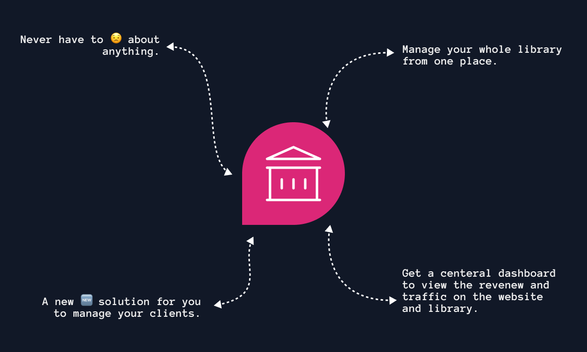
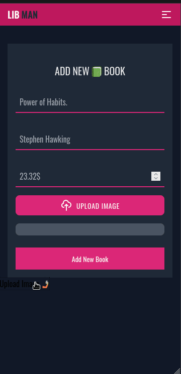
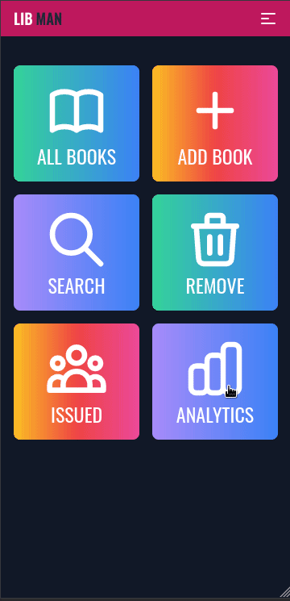
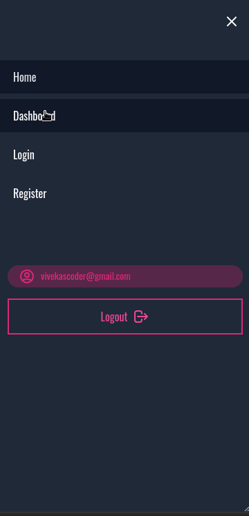
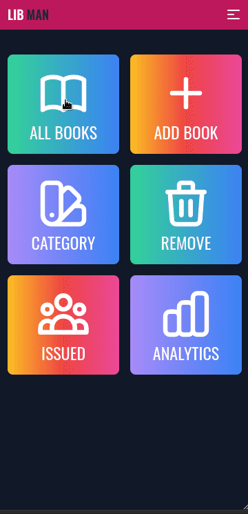

# 🏫 Libman 
> A new way to manage your library 🏫. Manage all of your daily task using our web 🕸️ application.

<p align="center">
  
</p>

- A PWA solution for managing library.
- Using VueJS and 🔥 Firebase.

## 🖥️ Demo
<div style="display: flex; align-items: center; justify-items: center;">
  <div style="margin: 1rem;">
    
  </div>
  <div style="margin: 1rem;">
    
  </div>
  <div style="margin: 1rem;">
    
  </div>
</div>

<div style="display: flex; align-items: center; justify-items: center;">
  <div style="margin: 1rem;">
    
  </div>
  <div style="margin: 1rem;">
    
  </div>
  <div style="margin: 1rem;">
    
  </div>
</div>


## 📦️ Relationship.
- **Book**
  - BookId
  - Name
  - Author
  - Price
  - isAvailable
  - Image
  - Category :: Category

- **Category**
  - name
  - by :: User

## TODO
- [x] Making /books endpoint funtional and look lood.
- [x] Creating a form to add new book, and creating the /books/add route maybe.
- [x] Implement page transitions.
- [x] Transitiong in Navbar.
- [ ] Fix the transition in Tab.
- [ ] Change the design of Navbar. (#navbar-layout)
- [ ] Make a page to search the Books, 
- [x] Implement an image upload on Book add.
- [x] Implement the firebase database to store the image.
- [ ] Fix the navigation issue in Navbar component.
- [ ] Implement a feature to make some books favorite.
- [x] Chart integration where we can see the traffic on the website.
- [x] Create a add category page.
- [ ] Add a page to show issued book in a table form.
- [ ] Create a page to Issue a book by providin the no. of days.
- [ ] Cost will be calculated according to the number of days.
- [ ] Add a new field `isAvailable` is the book document.
- [ ] Make `isAvailable` false by default.
- **NOT CONFIRMED:**
  - Add VueX for state management.


## navbar layout
```
|----------------------------|
|                            |
|           Home             |
|         Dashboard          |
|           Login            |
|         Register           |
|                            |
|                            |
|    /---------------\       |
|   |     Logout      |      |
|    \---------------/       |
|                            |
|                            |
|                            |
|                            |
|----------------------------|
```

## Contact Me || Hire Me || Let's Connect
- Twitter: https://twitter.com/vivekascoder
- Github: https://github.com/vivekascoder
- LinkedIn: https://www.linkedin.com/in/vivek-kumar-7a04ba1b1/
- Instagram: https://instagram.com/vivekascoder