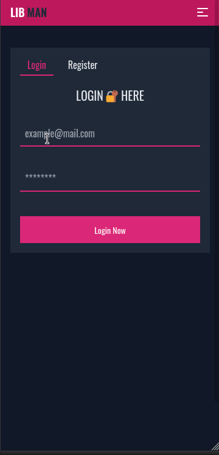
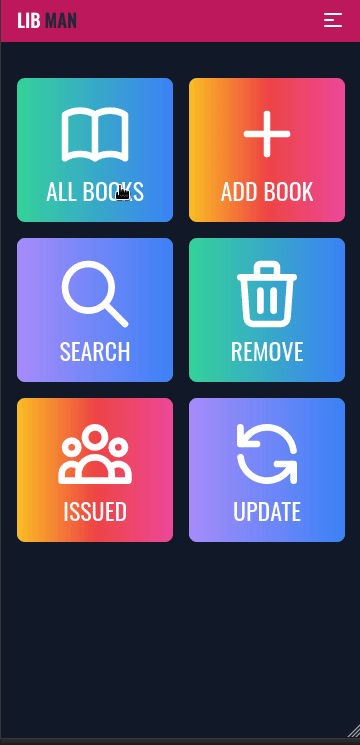

# Libman

- A PWA solution for managing library.
- Using VueJS and 🔥 Firebase.

## Demo
<p align="center">
  
</p>
<p align="center">
  
</p>

## Relationship.
- Book
  - BookId
  - Name
  - Author
  - Price

## TODO
- [x] Making /books endpoint funtional and look lood.
- [x] Creating a form to add new book, and creating the /books/add route maybe.
- [x] Implement page transitions.
- [x] Transitiong in Navbar.
- [ ] Fix the transition in Tab.
- [ ] Change the design of Navbar. (#navbar-layout)
- [ ] Make a page to search the Books, 
- [ ] Implement an image upload on Book add.
- [x] Implement the firebase database to store the image.
- [ ] Fix the navigation issue in Navbar component.
- [ ] Implement a feature to make some books favorite.


## navbar layout
```
|----------------------------|
|                            |
|           Home             |
|         Dashboard          |
|           Login            |
|         Register           |
|                            |
|                            |
|    /---------------\       |
|   |     Logout      |      |
|    \---------------/       |
|                            |
|                            |
|                            |
|                            |
|----------------------------|
```